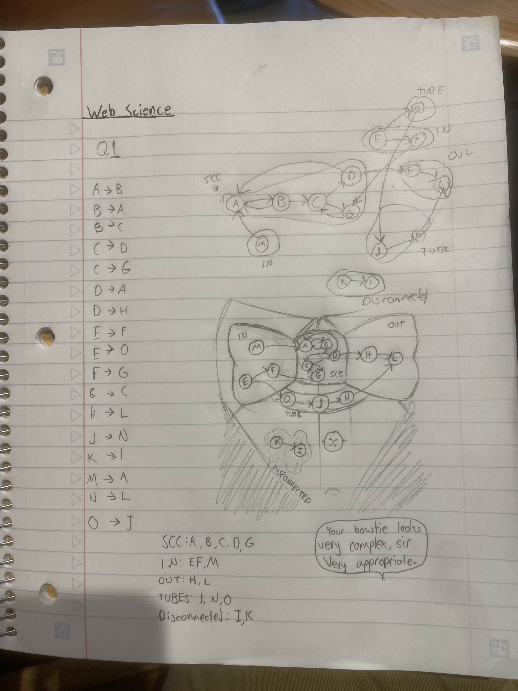
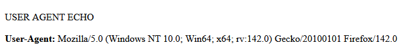
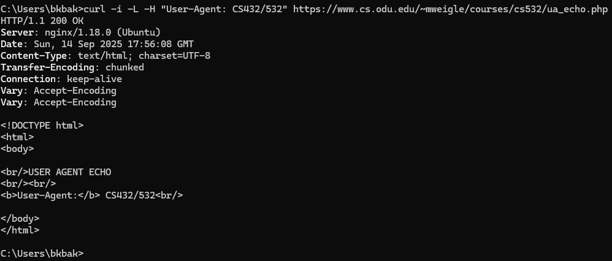
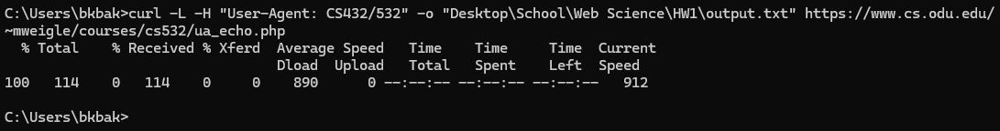
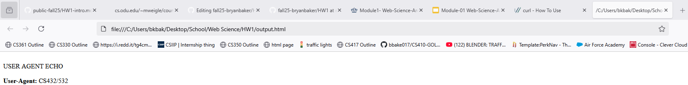

# HW1 - Web Science Intro
### Bryan Baker
### CS 432, Fall 2025
### September 14th, 2025

# Q1

Given the links:
```text
A --> B
B --> A
B --> C
C --> D
C --> G
D --> A
D --> H
E --> F
E --> O
F --> G
G --> C
H --> L
J --> N
K --> I
M --> A
N --> L
O --> J
```
Construct the resulting graph showing how the nodes are connected to each other, and then list the nodes in alphabetical order in each of the categories. For tubes, explain how the nodes listed are tubes.

## Answer

The figure below shows me writing out the links, making an initial graph as I went along looking at the links, and finally a more organized (and nice looking) graph showing the relationships of the links, alongside labels to clearly show the group that a link would be grouped in.
 


For the order in which links appear in a group:
* SCC: A, B, C, D, G
* IN: E, F, M
* OUT: H, L
* TUBES: J, N, O
* DISCONNECTED: I, K

For the lack of a tendril category:
I personally do not see any nodes that could be classified as tendrils, either IN or OUT, as all of the nodes that are interconnected seem to either start in what I would classify as IN, or end in OUT.

For the nodes I put in the tubes category:
The series of nodes J, N, O, these are the nodes that connect the beginning part of some nodes in IN, being E, to nodes in OUT, being L, without ever passing through the SCC section.

# Q2
A) First, load https://www.cs.odu.edu/~mweigle/courses/cs532/ua_echo.php in your web browser. The result should show the "User-Agent" HTTP request header that your web browser sends to the web server. Take a screenshot to include in your report.

B) Then, use a single `curl` command with the appropriate options to do the following:
  * request the URI
  * show the HTTP response headers
  * follow any redirects
  * change the User-Agent HTTP request field to "CS432/532"

Take a screenshot of the `curl` command and options you used and the result of your execution to include in your report.

C) After that, use a single `curl` command with the appropriate options to do the following:
  * request the URI
  * follow any redirects
  * change the User-Agent HTTP request field to "CS432/532"
  * save the HTML output to a file

Take a screenshot of the `curl` command and options you used and the result of your execution to include in your report.  

D) Finally, view the HTML output file that was produced by `curl` from part c in a web browser and take a screenshot to include in your report.

## Answer
A)



This shows that my user agent is:
```text
Mozilla/5.0 (Windows NT 10.0; Win64; x64; rv:142.0) Gecko/20100101 Firefox/142.0
```

B) 



The command that was used in the command line requests the URI, while also showing the HTTP response headers, following any possible redirects, and by using a modified User-Agent request field (changed to "CS432/532"), and then outputs it to the command line.

C) 



The command that was used in the command line requests the URI,  following any possible redirects, and by using a modified User-Agent request field (changed to "CS432/532"), and then outputs it an HTML file in my personal working directory for this class.

D)



This is the HTML file as read in my Mozilla Firefox browser that was generated by the command in part C.

# Q3
For some of our later assignments, you will be analyzing large numbers of webpages. The goal of this question is to write a Python program to gather URIs of webpages that have enough text so they will be useful later.

Your program must do the following:

    take the URI of a seed webpage as a command-line argument
    extract all the links from the page's HTML
    for each link, request the URI and use the Content-Type HTTP response header to determine if the link references an HTML file (text/html)
        if it does, use the Content-Length HTTP response header to determine if it contains more than 1000 bytes
            if it does, then print the final URI (after any redirects)

Use this program to collect at least 500 unique URIs of webpages that contain more than 1000 bytes. Save the list of URIs to a file to use in later assignments. The file must be uploaded to your GitHub repo.

Be aware of the need for a timeout. If you use the Python requests library, make sure to include the timeout parameter to your call to get().

    Example: requests.get(url, timeout=5)   # 5 second timeout

There are a couple ways you can use your program to gather the URIs:

    run the program multiple times with different seed webpages until you get to 500
    have your program randomly pick a URI that you've collected and use that as the new seed until you've collected 500 unique URIs

(copied the question because i was feeling lazy after making the program)
## Answer


Source Code:

```python
from bs4 import BeautifulSoup
import requests
import sys
import random

def getLinks(baseURL, linkSet):

    response = requests.get(baseURL, params={'q': 'LSU'})
    soup = BeautifulSoup(response.text, "html.parser") # get headers of base page

    for links in soup.find_all('a'):
        if len(linkSet) > 500:
            break
        try:
            link = links.get('href')
            if link.startswith('/'):  # To help with inlinks that opt to use not the entire link
                link = baseURL + link
            if link.endswith('/'): # To prevent duplicate links with differences being the prescence of an ending /
                link = link[:-1]


            if link.startswith('http'):
                if link in linkSet:
                    continue
                try:
                    linkResponse = requests.get(link, timeout=5, params={'q': 'LSU'}) # get headers of the link
                    try:
                        #print(link, (str(linkResponse.headers['Content-Type'])).startswith('text/html'), (int(linkResponse.headers['Content-Length']) >= 1000))

                        if (str(linkResponse.headers['Content-Type'])).startswith('text/html'): # Checks to see if the link is to a html document
                            if int(linkResponse.headers['Content-Length']) >= 1000: # Check if length is at least 1000 bytes
                                linkSet.add(link)
                                print(link, (len(linkSet)+1))
                    except KeyError: # Handles
                        continue  
                except requests.exceptions.ReadTimeout:
                    continue
        
        except AttributeError: # Handles any weird links like those `None` ones which seem to crash this porgram
            continue

def printLinks(linkSet):
    with open("links.txt", "a") as outFile:
        for link in linkSet:
            outFile.write(link)
            outFile.write('\n')
def main():
    baseURL = sys.argv[1]

    linkSet = set() #
    getLinks(baseURL, linkSet)
    while len(linkSet) < 500:
        print(f"Not enough links {len(linkSet)}/500")
        randomElement = random.choice(list(linkSet))
        getLinks(randomElement, linkSet)
    printLinks(linkSet)


if __name__ == '__main__':
    main()
```

Output if provided argument is "http://www.nytimes.com" can be found under links.txt in this folder of the repository


I opted to make a program that takes a singular URI and then repeatedly uses the links that it finds to get more links in an instance where it doesn't get to 500 unique URIs. 

I only used 
```text
https://www.nytimes.com
```
as a seed.

# References

* apache - HTTP Header Content-Length not work - Stack Overflow, <https://stackoverflow.com/questions/13873346/http-header-content-length-not-work>
* curl - How to use, <https://curl.se/docs/manpage.html>
* Beautiful Soup Documentation, <https://www.crummy.com/software/BeautifulSoup/bs4/doc/>
* python - Remove final character from string - Stack Overflow, <https://stackoverflow.com/questions/15478127/remove-final-character-from-string>
* Python File Write, <https://www.w3schools.com/python/python_file_write.asp>
