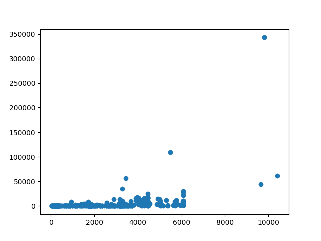
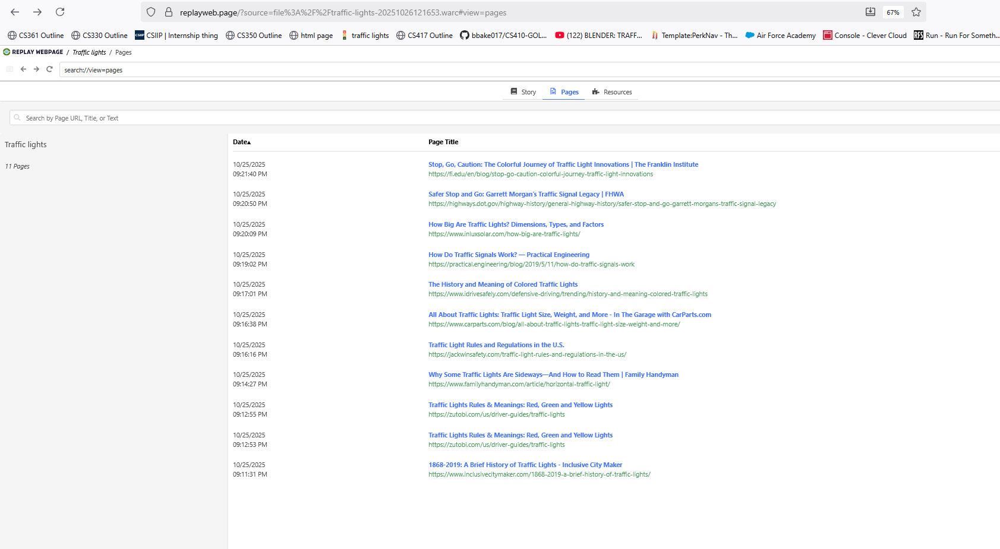
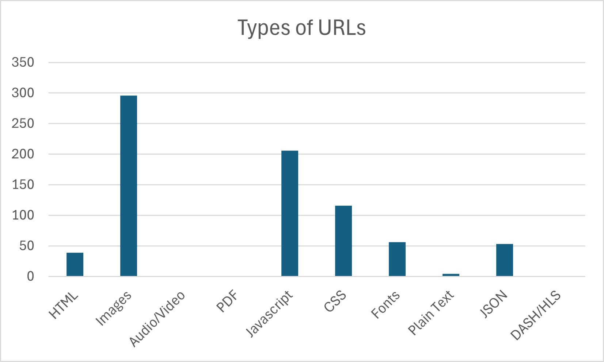

# HW 4
### Bryan Baker
### CS 432, Fall 2025
### October 26th, 2025

# Q1

For each of the URI-Rs from HW3, Q2 that had > 0 mementos, use the saved TimeMap to determine the datetime of the earliest memento. 

Create a scatterplot with the age of each URI-R (days between collection date and earliest memento datetime) on the x-axis and number of mementos for that URI-R on the y-axis.  For this graph, the item is the URI-R and the attributes are the estimated age of the URI-R (channel is horizontal position) and the number of mementos for that URI-R (channel is vertical position).

*Q: What can you say about the relationship between the age of a URI-R and the number of its mementos?*

*Q: What URI-R had the oldest memento? Did that surprise you?*

*Q: How many URI-Rs had an age of < 1 week, meaning that their first memento was captured the same week you collected the data?*   

## Answer

question1.py
```python
import tarfile
import json
import datetime
import numpy as np
import matplotlib.pyplot as plt

def mapHashUrl(hashUrlDict):
    with open("..\\HW3\\HashURL-Mappings.txt") as inFile:
        for line in inFile:
            tempEntry = []
            for word in line.split():
                tempEntry.append(word)
            tempKey = tempEntry[0]
            tempValue = tempEntry[1]
            hashUrlDict.update({tempKey: tempValue})

def countMementos(hashUrlDict, urlMementoDict, mementoEarliest):
    
    for key, value in hashUrlDict.items():
        tar = tarfile.open(f"..\\HW3\\mementos\\{key}.tar")
        for member in tar.getmembers():
            try:
                inJSON = tar.extractfile(member)
                currentMemento = json.load(inJSON)
                urlMementoDict.update({currentMemento["original_uri"] : len(currentMemento["mementos"]["list"])})

                earliest = currentMemento["mementos"]["first"]["datetime"]
                earliestDateTime = datetime.datetime(int(earliest[0:4]), int(earliest[5:7]), int(earliest[8:10]), int(earliest[11:13]), int(earliest[14:16]), int(earliest[17:19]))

                mementoEarliest.update({currentMemento["original_uri"] : earliestDateTime})
            except Exception as e:
                continue
        tar.close()

def plotMementoDate(urlMementoDict, sortedMementos):
    collectionDate = datetime.datetime(2025, 10, 17, 14)
    x = []
    y = []
    lessThanWeekOld = 0
    for key, value in sortedMementos.items():
        age = collectionDate - value
        if age.days < 7: 
            lessThanWeekOld += 1
        x.append(age.days)
        y.append(urlMementoDict[key])
    
    print(f"The URI-R that has the oldest memento of the {len(urlMementoDict)} collected is '{list(sortedMementos)[0]}'")
    print(f"Out of {len(urlMementoDict)} URI-Rs, {lessThanWeekOld} had an age of less than a week old from the day of collection.")

    plt.scatter(x, y)
    plt.show()

def main():
    hashUrlDict = dict()
    urlMementoDict = dict()
    mementoEarliest = dict()
    mapHashUrl(hashUrlDict)
    countMementos(hashUrlDict, urlMementoDict, mementoEarliest)

    sortedMementos = dict(sorted(mementoEarliest.items(), key=lambda item: item[1]))

    plotMementoDate(urlMementoDict, sortedMementos)

if __name__ == '__main__':
    main()
```

This code segment reuses a lot of HW3's solution, as well as opting to use the HashURL-Mappings.txt found in HW3's folder instead of copying it into this directory. It first begins mapping URLs with their respective hashes, and then going through each memento also present in HW3's folder. It then goes through each memento and finds the amount of mementos for each URL as well as the time of the oldest memento recorded. AFter this, it then sorts the URLs and earliest memento time dict into another dict by earliest, meaning the first element of the dict is the oldest. After getting that info, it then calculates the age of the last memento recorded for each URL using the collection date of October 10th, 2025 at 14:00 and stores the age of the URL in a list 'x' and the amount of mementos that the URL has in a list 'y'. It then does this for every URL present in the sortedMementos dict. After this, it prints out 
```
The URI-R that has the oldest memento of the 420 collected is 'https://www.theguardian.com'
Out of 420 URI-Rs, 0 had an age of less than a week old from the day of collection.
```

as well as 



*Q: What can you say about the relationship between the age of a URI-R and the number of its mementos?* 

It seems that the older a link it, theres a higher chance that it has a higher amount of mementos, with a few outliers showing the extreme of that trend.

*Q: What URI-R had the oldest memento? Did that surprise you?*

The URI-R that has the oldest memento of the 420 collected was 'https://www.theguardian.com' which doesn't surprise me due to *the Guardian* being a large legacy media outlet that has been around for a long time.

*Q: How many URI-Rs had an age of < 1 week, meaning that their first memento was captured the same week you collected the data?*   

Strangely, none of the links that I had gathered had no mementos that were noted within a week of collection to memento generation. I had collected the links on October 17, 2025 which is found in my file at ```collectionDate = datetime.datetime(2025, 10, 17, 14)```.


# Q2

Create an account at [Conifer](https://conifer.rhizome.org) and create a collection.  Archive at least 10 webpages related to a common topic that you find interesting. Make the collection public and include the link to your collection in your report.

*Q: Why did you choose this particular topic?*

*Q: Did you have any issues in archiving the webpages?*

*Q: Do the archived webpages look like the original webpages?*

After creating your collection at Conifer, download the collection as a WARC file (see [Exporting or Downloading Content](https://guide.conifer.rhizome.org/docs/manage-sessions/exporting-warc/)).

Then load this WARC file into [ReplayWeb.page](https://replayweb.page), a tool from the Webrecorder Project (folks who developed Conifer).  From <https://webrecorder.net/tools>:

<blockquote>ReplayWeb.page provides a web archive replay system as a single web site (which also works offline), allowing users to view web archives from anywhere, including local computer or even Google Drive. See the <a href="https://replayweb.page/docs">User guide</a> for more info.</blockquote>

Once the WARC file has loaded, click on the "Pages" tab.  Take a screenshot that includes the list of pages and the browser address bar (showing `replayweb.page/?source=file%3A%2F%2F`..., which indicates that the WARC file is being loaded from your local computer).

Then click on the "URLs" tab and choose "All URLs" from the dropdown menu.  

*Q: How many URLs were archived in the WARC file?  How does this compare to the number of Pages?*

Create a bar chart showing the number of URLs in the WARC file for each of the file types in the dropdown menu.

*Q: Which file type had the most URLs?  Were you surprised by this?*

## Answer

[Link to the collection](https://conifer.rhizome.org/bbake017/traffic-lights/)

I chose articles relating to the history and variations of traffic lights

*Q: Why did you choose this particular topic?* | I like traffic lights and how they look.

*Q: Did you have any issues in archiving the webpages?* | Some of the links I tried either didn't archive at all, or instead looked like a bunch of symbols on the screen

*Q: Do the archived webpages look like the original webpages?* | Yeah

Here is the list of URLs that were in my collection.



*Q: How many URLs were archived in the WARC file?  How does this compare to the number of Pages?* | There were a total of 1856 URLs in the file, contrasted with 11 pages. (One was a duplicate page that was attached to one session as another, and I was unable to remvoe one without removing another)

Here is a bart chart showing the different number of URLs in the warc file



*Q: Which file type had the most URLs?  Were you surprised by this?* | The type with the most URLs were image links, which didn't surprise me any with how many images are used in the construction of a website and various linkings they use. 

# References

* datetime — Basic date and time types — Python 3.14.0 documentation, <https://docs.python.org/3/library/datetime.html#examples-of-usage-datetime>
* Python Dates, <https://www.w3schools.com/python/python_datetime.asp>
* Matplotlib Getting Started, <https://www.w3schools.com/python/matplotlib_getting_started.asp>
* Matplotlib Scatter, <https://www.w3schools.com/python/matplotlib_scatter.asp>
* Python Arrays, <https://www.w3schools.com/python/python_arrays.asp>
* How to find the first key in a dictionary? (python) - Stack Overflow, <https://stackoverflow.com/questions/30362391/how-to-find-the-first-key-in-a-dictionary-python>

## Found in Traffic Light collection

* Traffic Lights Rules & Meanings: Red, Green and Yellow Lights, <https://zutobi.com/us/driver-guides/traffic-lights>
* Stop, Go, Caution: The Colorful Journey of Traffic Light Innovations | The Franklin Institute, <https://fi.edu/en/blog/stop-go-caution-colorful-journey-traffic-light-innovations>
* Safer Stop and Go: Garrett Morgan’s Traffic Signal Legacy | FHWA, <https://highways.dot.gov/highway-history/general-highway-history/safer-stop-and-go-garrett-morgans-traffic-signal-legacy>
* How Big Are Traffic Lights? Dimensions, Types, and Factors, <https://www.inluxsolar.com/how-big-are-traffic-lights/>
* How Do Traffic Signals Work? — Practical Engineering, <https://practical.engineering/blog/2019/5/11/how-do-traffic-signals-work>
* The History and Meaning of Colored Traffic Lights, <https://www.idrivesafely.com/defensive-driving/trending/history-and-meaning-colored-traffic-lights>
* All About Traffic Lights: Traffic Light Size, Weight, and More - In The Garage with CarParts.com, <https://www.carparts.com/blog/all-about-traffic-lights-traffic-light-size-weight-and-more/>
* Traffic Light Rules and Regulations in the U.S., <https://jackwinsafety.com/traffic-light-rules-and-regulations-in-the-us/>
* Why Some Traffic Lights Are Sideways—And How to Read Them | Family Handyman, <https://www.familyhandyman.com/article/horizontal-traffic-light/>
* 1868-2019: A Brief History of Traffic Lights - Inclusive City Maker, <https://www.inclusivecitymaker.com/1868-2019-a-brief-history-of-traffic-lights/>
