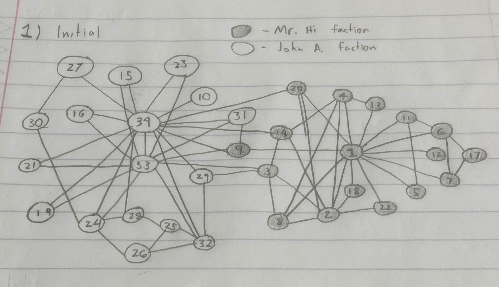

# HW 5
### Bryan Baker
### CS 432, Fall 2025
### November 2nd, 2025

# Q1

Draw the original Karate club graph (before the split) and color the nodes according to the factions they belong to (John A or Mr. Hi).  This should look similar to the graph on slide 92 - all edges should be present, just indicate the nodes in the eventual split by color.

*Q: How many nodes eventually go with John and how many with Mr. Hi?*

## Answer



# Q2

We know the "real" result of the Karate Club split, which you've colored in Q1. Your task is to use the Girvan-Newman algorithm to show that this result of the split could have been predicted by the weighted graph of social interactions.  How well does the mathematical model represent reality?  Generously document your answer with all supporting equations, code, graphs, arguments, etc.

Keeping the node colors the same as they were in Q1, run multiple iterations of the Girvan-Newman graph partioning algorithm (see [Social Networks, slides 90-99](https://docs.google.com/presentation/d/1G9bY32EslxRdIq7znDZoGJd3-_Ock1FeJcqN3QgQuy4/edit#slide=id.p98)) on the Karate Club graph until the graph splits into two connected components. Include an image of the graph *after each iteration* in your report.  

Note that you will have to implement the Girvan-Newman algorithm rather than relying on a built-in function, because a built-in function will automatically run the whole algorithm and you will not be able to view the intermediate graphs.  Make sure that you explain in your report what the Girvan-Newman algorithm is doing.

*Q: How many iterations did it take to split the graph?*  

**Note:** We are aware of solutions online that appear to answer this question.  However, the solutions do not adequately meet the requirements of this question. You must implement the Girvan-Newman algorithm (not community detection) and you must draw the graph after each iteration of the Girvan-Newman algorithm.

## Answer

question2.py
```python
import matplotlib.pyplot as plt
import networkx as nx

karateGraph = nx.karate_club_graph()

color = ["#1f78b4"] * 34
color[0] = "green"  # Mr. Hi
color[1] = "green"
color[2] = "green"
color[3] = "green"
color[4] = "green"
color[5] = "green"
color[6] = "green"
color[7] = "green"
color[8] = "green"
color[9] = "red"
color[10] = "green"
color[11] = "green"
color[12] = "green"
color[13] = "green"
color[14] = "red"
color[15] = "red"
color[16] = "green"
color[17] = "green"
color[18] = "red"
color[19] = "green"
color[20] = "red"
color[21] = "green"
color[22] = "red"
color[23] = "red"
color[24] = "red"
color[25] = "red"
color[26] = "red"
color[27] = "red"
color[28] = "red"
color[29] = "red"
color[30] = "red"
color[31] = "red"
color[32] = "red"
color[33] = "red"   # John

# Initial Graph
print("Initial Graph:")
nx.draw_kamada_kawai(karateGraph, with_labels=True, node_color=color)
plt.show()  

iter = 0
while(karateGraph.number_of_edges() > 0 and nx.number_connected_components(karateGraph) < 2): # The alogorithm
    iter += 1

    allEdgesBetweenList = nx.edge_betweenness_centrality(karateGraph, k=None, normalized=True, weight=None, seed=None)
    maxEdge = max(allEdgesBetweenList, key=allEdgesBetweenList.get)

    print(f"Highest edge betweenness value: {maxEdge} : {allEdgesBetweenList[maxEdge]}") 
    print(f"Iteration #{iter} ")

    karateGraph.remove_edge(maxEdge[0], maxEdge[1]) # Remove edge with largest edge betweenenss value

    #nx.draw_kamada_kawai(karateGraph, with_labels=True, node_color=color)
    #plt.show()
    

print(f"This took {iter} iterations")
nx.draw_networkx(karateGraph, with_labels=True, node_color=color)
plt.show()
```


# Q3

Compare the connected components of the Girvan-Newman split graph (Q2) with the connected components of the actual split Karate club graph (Q1). 

*Q: Did all of the same colored nodes end up in the same group?  If not, what is different?*

## Answer


# References
